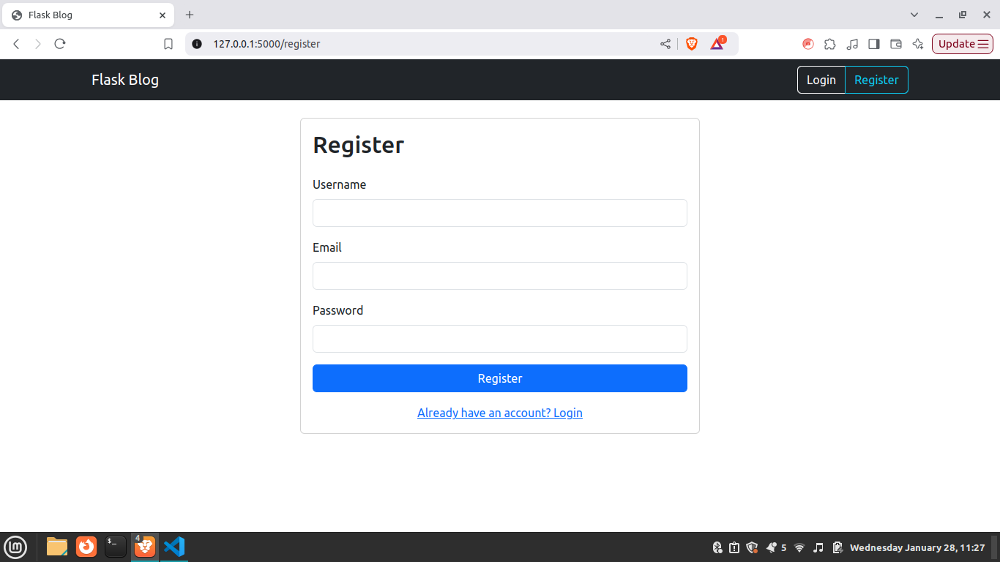
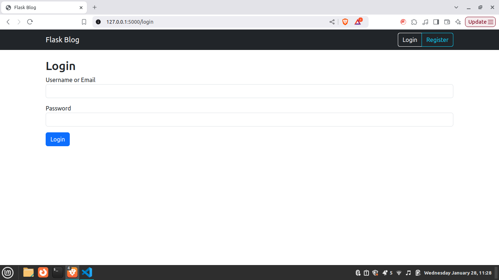
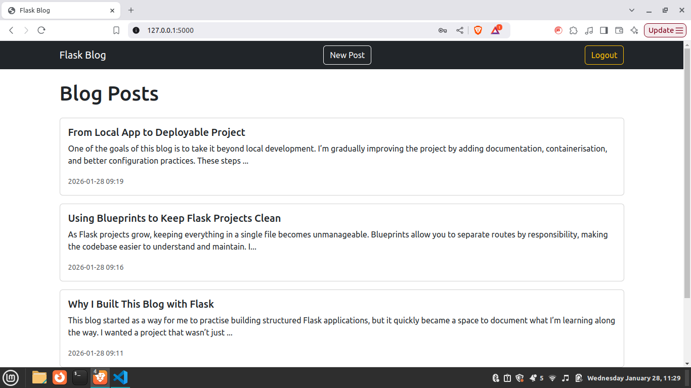
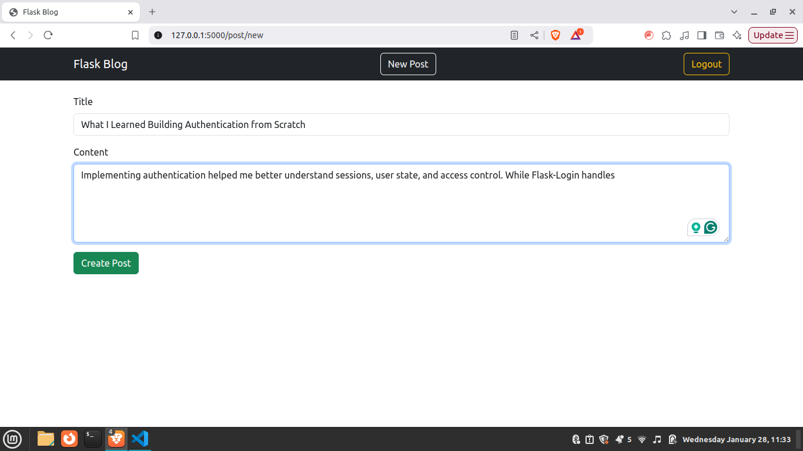
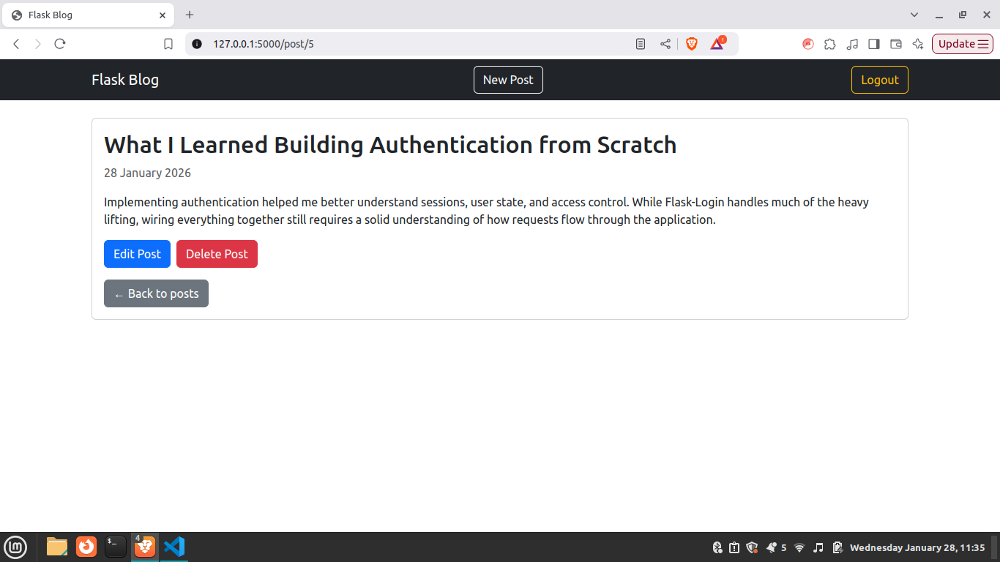

# Personal Portfolio Website

A simple blog web application built with Flask that allows users to register, log in, create posts, and view blog content.  
This project is part of my ongoing learning and portfolio development as a Software Engineer, with a focus on clean structure, best practices, and incremental improvements.


---

## Features

- User registration and authentication
- Login and logout functionality
- Create, view, and list blog posts
- SQLite database for data persistence
- Flask Blueprints for modular routing
- HTML templates with a shared base layout
- Custom CSS styling

---


## Tech Stack

- **Python**
- **Flask**
- **Flask-SQLAlchemy**
- **Flask-Login**
- **SQLite**
- **HTML / CSS**

---

## Project Structure

```text
app/
├── __init__.py
├── models.py
├── routes/
│   ├── auth.py
│   └── main.py
├── templates/
│   ├── base.html
│   ├── home.html
│   ├── login.html
│   ├── create_post.html
│   ├── post_detail.html
│   ├── post_list.html
│   └── register.html
├── static/
│   └── css/
│       └── styles.css
├── blog.db

requirements.txt
run.py
```


## Screenshots

### Home Page (Logged Out)


---

### User Registration


---

### User Login


---

### Blog Post List (Logged In)


---

### Create New Post


---

### Blog Post Detail



## Setup Instructions (Local Development)

1. **Clone the repository**
```bash
git clone https://github.com/KwaneleMyeza/blog-app.git
cd blog-app 
```

2. **Create a virtual environment**
```bash
python -m venv venv
source venv/bin/activate  # On Windows: venv\Scripts\activate
```

3. **Install dependencies**
```bash
pip install -r requirements.txt
```

4. **Run the Application**
```bash
flask run
```

6. Visit http://127.0.0.1:5000 in your browser.
